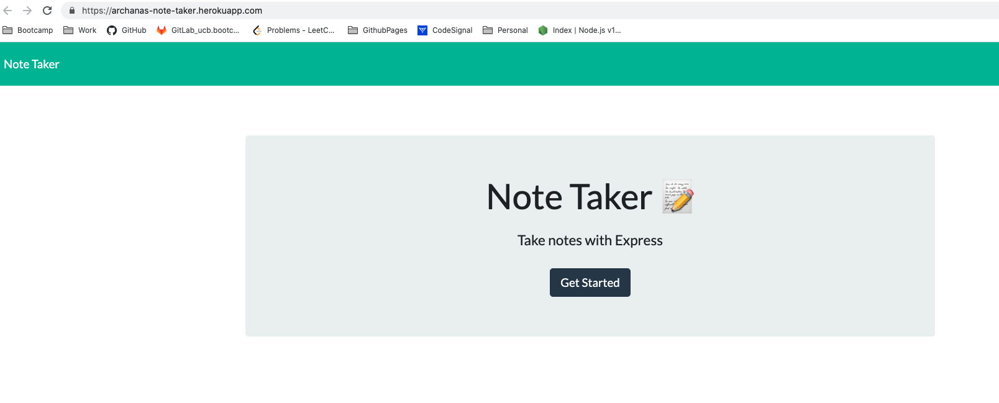
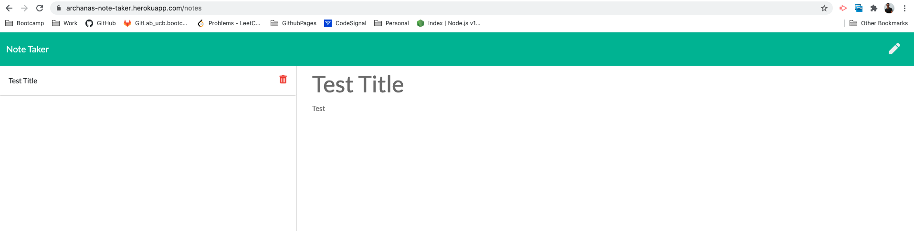
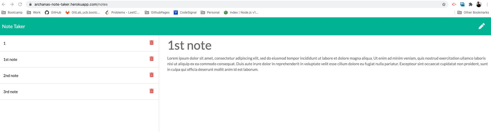
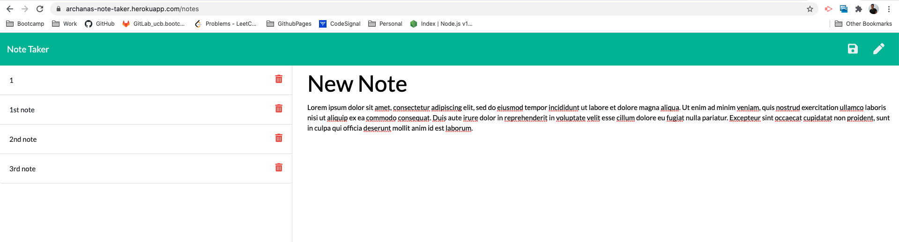
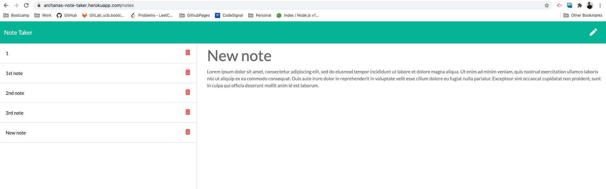
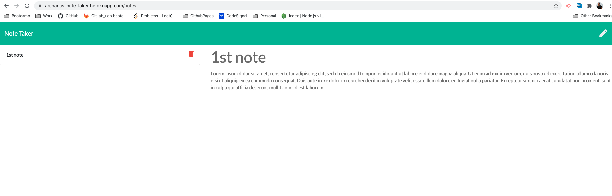

# Note Taker

## Description

A nodejs application that can be used to write and save notes. This application will use an Express.js back end and will save and retrieve note data from a JSON file. 
**The Note Taker app is deployed and is live on [Heroku](https://archanas-note-taker.herokuapp.com/)**

## Table of Contents

* [Description](#description)
* [Demonstration](#demonstration)
* [Technologies](#technologies)
* [Installation](#installation)
* [License](#license)
* [Questions](#questions)

## Demonstration

### Demo video
* [Note-taker](https://drive.google.com/file/d/1mNuUI9wi6TTO-6MELPLR9i1X-xeH_1c_/view)

### Screenshots 
* GET `/` returns the `index.html` file. 
* GET `/notes` returns the `notes.html` file. 
* GET `/api/notes` reads the `db.json` file and return all saved notes as JSON.
* POST `/api/notes` receives a new note to save on the request.body, add it to the `db.json` file, 
    and then return the new note to the client when the save icon is clicked: Before Saveing the note:
    
* POST `/api/notes` after saving the note.
* DELETE `/api/notes/:id` should receive a query parameter containing the id of a note to delete. 

## Technologies

* [Node.js](https://nodejs.org/)
* [Express.js](https://expressjs.com/)
* [heroku](https://www.heroku.com/)

## Installation

* Local environment
    Clone the repository to your local development environment.
    `git clone git@github.com:archana-nagaraj/Note-Taker.git`
    Run `npm install` to install all dependencies. 
    To use the application locally, run `node express.js` in your CLI, and then open http://localhost:3000 in your browser. 

* The Note Taker app is live on [Heroku](https://archanas-note-taker.herokuapp.com/) for usage.

## License

This repository is licensed under the [MIT license](./LICENSE).

## Questions

For any questions about the project/repository please contact me @ [archana.nagaraj@gmail.com](mailto:archana.nagaraj@gmail.com)  
GitHub @ [archana-nagaraj](https://github.com/archana-nagaraj) 
